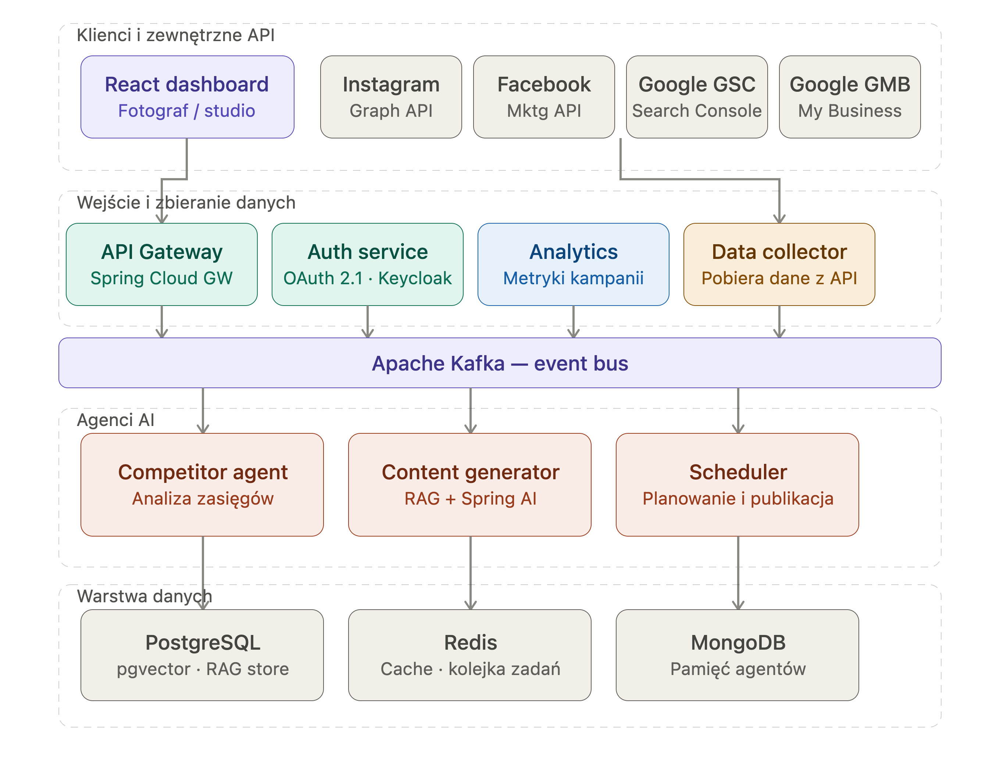

= Marketing Autopilot — Dokumentacja Architektoniczna
:author: Krzysztof Pobozan
:revdate: 2026-06
:toc: left
:toc-title: Spis treści
:toclevels: 3
:icons: font
:source-highlighter: highlight.js

== Cel projektu

*Marketing Autopilot* to narzędzie SaaS dla fotografów zastępujące agencję marketingową.
Aplikacja automatycznie zbiera dane z Instagrama, analizuje konkurencję i trendy w niszy,
a następnie generuje spersonalizowane rekomendacje marketingowe dla każdego fotografa.

=== Propozycja wartości

* Zastąpienie ręcznej analizy konkurencji i hashtagów
* Wykrywanie trendów w niszy fotograficznej (zdefiniowanej przez hashtagi)
* Spersonalizowane rekomendacje oparte na danych (nie intuicji)
* Oszczędność czasu fotografa — skupienie na robieniu zdjęć, nie analizie danych

---

== Stack technologiczny

[cols="1,2"]
|===
| Technologia | Wersja / opis

| Java | 21
| Spring Boot | 4.0.6
| Spring Cloud | 2025.1.1
| Kafka | Apache Kafka 4.x (KRaft, bez ZooKeeper)
| Spring Cloud Stream | StreamBridge (imperatywny publishing)
| Resilience4j | Circuit Breaker na wywołaniach zewnętrznych API
| PostgreSQL | Baza danych, Flyway do migracji
| JPA / Hibernate | Persystencja
| Lombok | Redukcja boilerplate
| MapStruct | 1.6.3 — mapowanie między warstwami
| WireMock | 3.9.2 — mockowanie HTTP w testach
| RestClient | Synchroniczny klient HTTP (nie WebClient — brak reaktywności)
| LangChain4j | Blok 5 — integracja z LLM
| Docker | Multi-stage build, JRE 21, healthcheck
|===

---

== Architektura systemu

=== Diagram komponentów

Diagram przedstawia docelowy, pełny obraz systemu — obejmujący nie tylko zaimplementowany
dotąd `data-collector`, ale też planowane komponenty (`api-gateway`, `auth-service`,
`analytics`, `content-generator`, `scheduler`) oraz pełną integrację ze wszystkimi
zewnętrznymi API (Instagram, Facebook, Google Search Console, Google My Business).

Warstwy systemu:

* **Klienci i zewnętrzne API** — React dashboard dla fotografa/studia oraz zewnętrzne
  API dostawców danych (Instagram Graph API, Facebook Marketing API, Google GSC, Google GMB)
* **Wejście i zbieranie danych** — API Gateway (routing), Auth service (OAuth 2.1 / Keycloak),
  Analytics (metryki kampanii), Data collector (pobieranie danych z zewnętrznych API)
* **Apache Kafka** — centralna magistrala zdarzeń łącząca warstwę zbierania danych
  z warstwą agentów AI
* **Agenci AI** — Competitor agent (analiza zasięgów, Blok 3/5 tej dokumentacji),
  Content generator (RAG + Spring AI), Scheduler (planowanie i publikacja treści)
* **Warstwa danych** — PostgreSQL z pgvector (RAG store), Redis (cache, kolejka zadań),
  MongoDB (pamięć agentów)

NOTE: Stan bieżący projektu (patrz <<Harmonogram bloków>>) obejmuje pełną implementację
warstwy `data-collector` oraz komunikację przez Kafkę. Pozostałe komponenty
(`api-gateway`, `auth-service`, `content-generator`, `scheduler`) oraz integracje
z Facebook/Google są elementami docelowej architektury, zaplanowanymi w kolejnych blokach.

=== Wzorzec architektoniczny

Projekt stosuje *architekturę heksagonalną* (Ports & Adapters) w każdym mikroserwisie:

* **Domain** — czyste klasy domenowe bez zależności frameworkowych
* **Port in** — interfejsy use case'ów (wejście do domeny)
* **Port out** — interfejsy do infrastruktury (wyjście z domeny)
* **Adapters** — implementacje portów: REST, Kafka, JPA, zewnętrzne API

=== Mikroserwisy

[cols="1,3"]
|===
| Moduł | Odpowiedzialność

| `common` | Współdzielone schematy Avro, eventy Kafka
| `api-gateway` | Brama dla klientów, routing, rate limiting
| `data-collector` | Integracja z Instagram API, zbieranie danych, persystencja konfiguracji
| `competitor-agent` | Analiza danych, wykrywanie trendów, rekomendacje AI
|===

=== Komunikacja między serwisami

[source]
----
Fotograf (przeglądarka)
    │
    ▼
api-gateway  ──REST──►  data-collector
                              │
                         Kafka events
                              │
                    ┌─────────┴──────────┐
                    ▼                    ▼
           CompetitorDataEvent    HashtagDataEvent
                    │                    │
                    └─────────┬──────────┘
                              ▼
                      competitor-agent
                              │
                         analiza + AI
                              │
                              ▼
                      RecommendationResult
----

==== Wzorzec Command → Event

`api-gateway` wysyła komendy REST do `data-collector` (który jest *single source of truth*
dla konfiguracji obserwowania). `data-collector` zapisuje stan i publikuje eventy.
Pozostałe serwisy konsumują eventy i budują własne projekcje.

[source]
----
POST /monitored-profiles  →  data-collector (zapis)
                                   │
                            event: CompetitorSubscribedEvent
                            event: HashtagSubscribedEvent
                                   │
                           competitor-agent (projekcja)
----

---

== Moduł: data-collector

=== Odpowiedzialność

* OAuth 2.0 z Meta / Instagram Graph API
* Zbieranie postów własnych fotografa i top_media hashtagów
* Zarządzanie tokenami dostępu (long-lived, auto-refresh)
* Persystencja konfiguracji: `AccessToken`, `MonitoredProfile`, `MonitoredHashtag`
* Publikacja eventów na Kafkę

=== Domain Model

[source,java]
----
AccessToken
    ownerIgId        // Instagram Business Account ID
    ownerUsername
    token
    tokenType        // SHORT_LIVED | LONG_LIVED
    expiresAt
    refreshedAt

MonitoredProfile
    ownerIgId        // fotograf
    competitorIgHandle
    active
    lastCollectedAt

CollectedPost
    shortcode
    ownerIgId
    mediaType        // IMAGE | VIDEO | CAROUSEL_ALBUM | REEL
    caption
    hashtags
    mentions
    likeCount
    commentsCount
    publishedAt

HashtagStats
    hashtag
    igHashtagId
    mediaCount       // 0 — niedostępne w Graph API
----

=== Kluczowe klasy infrastruktury

[cols="1,2"]
|===
| Klasa | Opis

| `InstagramOAuthClient` | OAuth flow: short-lived → long-lived token
| `InstagramGraphClient` | package-private, paginacja, error handling, X-App-Usage interceptor
| `InstagramApiClient` | @CircuitBreaker, fetchOwnMedia, fetchHashtagStats, fetchHashtagTopMedia
| `AppUsage` | Parsuje nagłówek X-App-Usage, warn >80%, throw @100%
| `InstagramTokenExpiredException` | Kod 190 — ignorowany przez Circuit Breaker
| `CompetitorEventKafkaAdapter` | StreamBridge — publikacja CompetitorDataEvent
| `HashtagEventKafkaAdapter` | StreamBridge — publikacja HashtagDataEvent
| `AccessTokenAdapter` | JPA — persystencja tokenów
| `MonitoredProfileAdapter` | JPA — persystencja konfiguracji obserwowania
| `DebugController` | @Profile("!production") — endpointy do testów E2E
| `HttpClientConfig` | RestClient.Builder, timeout 5s/30s
| `SecurityConfig` | permitAll /oauth/**, /meta/**, /actuator/health
|===

=== Obsługa Instagram API — ważne ograniczenia

* `ownerIgId` = **Instagram Business Account ID** (nie Facebook User ID)
  — pobierany przez `/me?fields=id,name,accounts{instagram_business_account{id,username}}`
* Timestamp format `+0000` (bez dwukropka) → custom `DateTimeFormatterBuilder`
* `top_media` — tylko pierwsza strona (paginacja powoduje timeout ~9s)
* `caption` wykluczone z `top_media` (błąd "reduce amount of data")
* `media_count` dla hashtagów niedostępne → ustawiamy 0
* IG Insights (impressions, reach, saved) — **MMP, nie MVP**

=== Flyway migracje

[cols="1,2"]
|===
| Migracja | Opis

| V1 | Tabela `access_tokens`
| V2 | Tabela `monitored_profiles`
|===

=== Resilience

* **Circuit Breaker** (Resilience4j) na wszystkich wywołaniach Instagram API
* Fallback: puste listy / null zamiast wyjątku
* `InstagramTokenExpiredException` (kod 190) ignorowana przez CB — nie liczy jako błąd
* **Rate limiting** przez nagłówek `X-App-Usage` — ostrzeżenie >80%, throw @100%

---

== Kafka Events

=== CompetitorDataEvent

Publikowany przez `data-collector` po zebraniu postów konkurenta.

[source]
----
CompetitorDataEvent {
    eventId, eventType, schemaVersion, source
    ownerIgId
    competitorIgHandle
    post {
        shortcode, mediaType, permalink
        likeCount, commentsCount
        publishedAt, caption, hashtags
    }
    ownerFollowerCount
    collectedAt
}
----

=== HashtagDataEvent

Publikowany przez `data-collector` po zebraniu top_media dla hashtaga.

[source]
----
HashtagDataEvent {
    eventId, eventType, schemaVersion, source
    ownerIgId
    hashtag
    igHashtagId
    collectedAt
    topMedia [ {
        id, mediaType, permalink
        likeCount, commentsCount
        publishedAt
    } ]
}
----

---

== Moduł: competitor-agent

=== Odpowiedzialność

* Konsumowanie eventów z Kafki
* Analiza statystyczna (Blok 3)
* Generowanie rekomendacji przez LLM (Blok 5)

=== Nisza fotografa

Fotograf definiuje niszę przez dwa mechanizmy:

. *Obserwowane hashtagi* — `MonitoredHashtag` — określają tematykę niszy
. *Obserwowani konkurenci* — `MonitoredProfile` — określają porównywaną grupę

Im więcej hashtagów posta z `top_media` pokrywa się z obserwowanymi hashtagami fotografa,
tym wyższa **waga niszy** (nicheWeight) tego posta dla danego fotografa.

=== NicheWeight — waga posta per fotograf

[source,java]
----
// waga = liczba pasujących hashtagów / wszystkie obserwowane hashtagi fotografa
double weight = matchingHashtags / totalObservedHashtags;
----

Waga jest przechowywana per post per fotograf w tabeli `post_niche_weights`:

[source,sql]
----
post_niche_weights (
    owner_ig_id,
    post_id,
    niche_weight,     -- 0.0 - 1.0
    matching_hashtags,
    total_hashtags,
    calculated_at
)
----

Indeks po `(owner_ig_id, niche_weight DESC)` — szybkie odpytywanie
top N postów niszy dla LLM.

=== Blok 3 — Analiza statystyczna

[cols="1,2"]
|===
| Serwis | Odpowiedzialność

| `EngagementAnalysisService` | Obliczanie ER per post i trend w czasie
| `HashtagPerformanceService` | Które hashtagi generują zasięg w niszy
| `OptimalPostingHoursService` | Kiedy konkurencja osiąga najwyższy ER
| `CaptionAnalysisService` | Korelacja stylu/długości/języka caption z ER
| `NicheWeightService` | Obliczanie wagi posta per fotograf
|===

Wynik analizy:

[source]
----
AnalysisResult (per fotograf, per okres)
    ownerIgId
    period
    ownerER              // własny engagement rate
    avgCompetitorER      // średnia konkurencji
    bestPostingTime      // np. "wtorek 18:00-20:00"
    topNicheHashtags     // hashtagi z najwyższym ER w niszy
    captionInsights      // korelacje: pytania, emoji, długość
----

=== Blok 5 — AI Recommendations (LangChain4j)

LLM nie analizuje surowych danych — **interpretuje gotowe wyniki z Bloku 3**.

[source]
----
AnalysisResult (Blok 3)
    + top N postów niszy (ORDER BY nicheWeight DESC)
    + dane historyczne fotografa
         │
         ▼
    Prompt do LLM (LangChain4j)
         │
         ▼
    RecommendationResult
    "W Twojej niszy teraz performują zdjęcia detali
     w ciepłej tonacji. Twoje posty z pytaniami w opisie
     mają 2x wyższy ER. Warto publikować we wtorki wieczorem."
----

Zalety tego podejścia:

* Minimalizacja ryzyka halucynacji — LLM operuje na konkretnych liczbach
* Niższe koszty tokenów — kontekst jest skompresowany przez Blok 3
* Łatwiejsze testowanie — logika analityczna testowana bez AI

---

== Harmonogram bloków

[cols="1,1,2"]
|===
| Blok | Status | Zakres

| B1 | ✅ DONE | Setup infrastruktury, CI/CD, Docker Compose
| B2 | ✅ DONE* | data-collector, Instagram API, OAuth, Kafka events
| B3 | 🔄 W TOKU | competitor-agent, domain model, analiza statystyczna
| B4 | ⏳ TODO | api-gateway, REST API dla frontendu
| B5 | ⏳ TODO | LangChain4j, AI recommendations
|===

*Świadome pominięcia w B2 (MVP scope):

* `App Review` — niepotrzebny do czasu wejścia na produkcję
* `Bucket4j rate limiting` — lepiej na poziomie api-gateway niż per serwis
* `IG Insights` — MMP, nie MVP (impressions, reach, saved)

---

== Decyzje architektoniczne

=== RestClient zamiast WebClient

`data-collector` używa Spring MVC (servlet-based) i JPA (JDBC — blokujące I/O).
Pełne reaktywne flow wymagałoby R2DBC + WebFlux na każdym poziomie stosu.
`RestClient` jest uczciwie synchroniczny i nie wymaga `.block()`.

=== Single Source of Truth dla konfiguracji obserwowania

`data-collector` jest właścicielem stanu `MonitoredProfile` i `MonitoredHashtag`.
`api-gateway` wysyła komendy REST do `data-collector`, który zapisuje stan
i publikuje eventy. Inne serwisy budują własne projekcje z eventów.
Zapobiega to utracie stanu przy restarcie serwisu.

=== NicheWeight per post per fotograf

Ten sam post może mieć różną wagę niszy dla różnych fotografów
(każdy ma inny zestaw obserwowanych hashtagów).
Waga jest obliczana i zapisywana przez `competitor-agent`
jako osobna encja łącząca post z fotografem.

=== Circuit Breaker ignoruje kod 190

`InstagramTokenExpiredException` (kod błędu 190 = token wygasł)
jest ignorowana przez Circuit Breaker — to błąd konfiguracyjny, nie awaria API.
CB otwiera się tylko na błędy sieciowe i błędy serwera Meta.

---

== Konwencje testowania

* **WireMock** — `wireMock.stubFor()` na instancji (nigdy statyczny `givenThat()`)
* **BDD style** — `BDDMockito.then()` do weryfikacji, `BDDAssertions.then()` do asercji
* `jsonResponse(body, statusCode)` zamiast `aResponse().withStatus().withHeader(...)`
* `argThat()` zawsze z null-checkiem: `argThat(x -> x != null && ...)`
* `BDDSoftAssertions` — lokalna instancja z jawnym `assertAll()` gdy 1-2 testy;
  `@InjectSoftAssertions` gdy większość testów w klasie potrzebuje soft assertions
* `@WebMvcTest` dla kontrolerów, `@MockitoBean` (Spring Boot 4.x) zamiast `@MockBean`